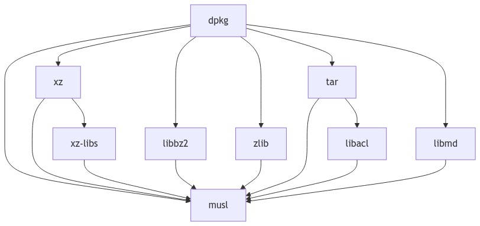
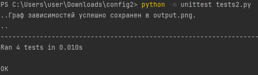

# Описание проекта

## Задание
Разработать инструмент командной строки для визуализации графа
зависимостей, включая транзитивные зависимости. Сторонние средства для
получения зависимостей использовать нельзя.
Зависимости определяются по имени пакета ОС Alpine Linux (apk). Для
описания графа зависимостей используется представление Mermaid.
Визуализатор должен выводить результат в виде сообщения об успешном
выполнении и сохранять граф в файле формата png.
Ключами командной строки задаются:
- Путь к программе для визуализации графов.
- Имя анализируемого пакета.
- Путь к файлу с изображением графа зависимостей.
Все функции визуализатора зависимостей должны быть покрыты тестами.


### Запуск программы

Для запуска необходимо ввести команду:

```
python  main.py <имя пакета> output.png
```

### Запуск тестов

```
python -m unittest tests.py
```

В ходе работы:
1. Была разработана реализация графа зависимостей:



2. Написаны тесты, которые успешно выполняются:

